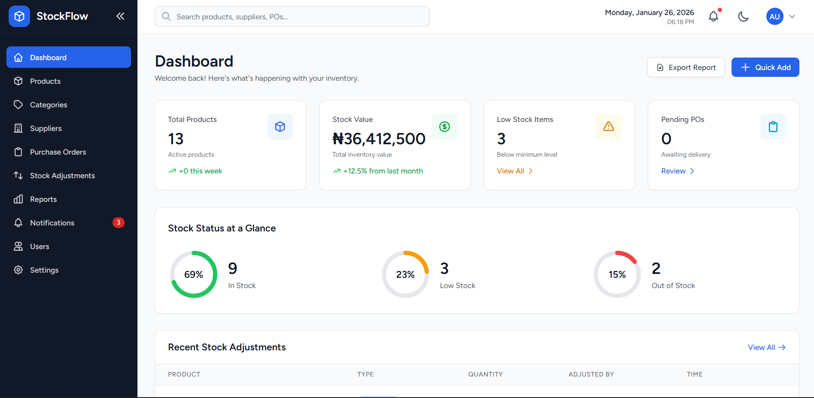
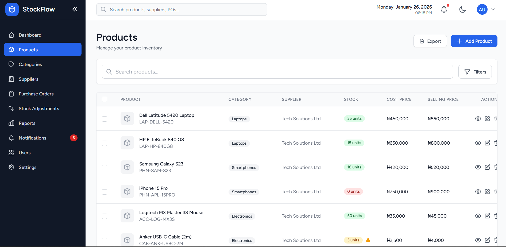
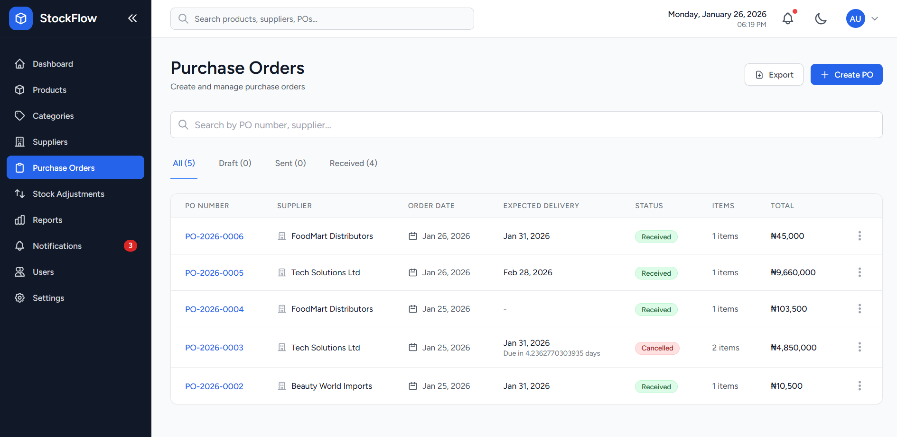
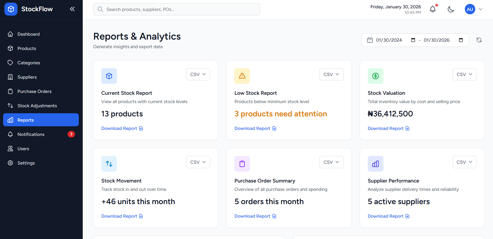

# StockFlow - Inventory Management System

<div align="center">
  
  
  
  
</div>

## 📋 Overview

**StockFlow** is a powerful yet intuitive inventory management system designed to help small to medium businesses track stock levels, manage suppliers, process purchase orders, and gain real-time insights into inventory performance. Built with Laravel 11 and Livewire 3, StockFlow provides a modern, reactive interface for efficient warehouse and inventory operations.

### ✨ Key Features

- 📦 **Real-time Stock Tracking** - Monitor inventory levels with automatic low-stock alerts
- 🏷️ **Barcode Management** - Auto-generate and print barcode labels (EAN-13, UPC-A, Code 128)
- 🔔 **Smart Notifications** - Get alerted for low stock, out-of-stock items, and PO updates
- 👥 **Role-Based Access Control** - Admin, Manager, and Staff roles with granular permissions
- 📊 **Visual Analytics** - Charts and reports for inventory performance insights
- 🛒 **Purchase Order Management** - Complete workflow from creation to receiving
- 📱 **Responsive Design** - Works seamlessly on desktop, tablet, and mobile devices
- 🌙 **Dark Mode** - Fully customizable theme system with persistent user preferences
- ⚙️ **Comprehensive Settings** - Personalize notifications, appearance, security, and company information
- 📈 **Advanced Reports** - Stock valuation, movement history, and supplier performance

---

## 🚀 Quick Start

### Prerequisites

- PHP 8.2 or higher
- Composer
- MySQL 8.0+
- Node.js & npm
- Visual Studio Code (optional, for local development)

### Installation

1. **Clone the repository**
   ```bash
   git clone https://github.com/TomisinII/stockflow.git
   cd stockflow
   ```

2. **Install dependencies**
   ```bash
   composer install
   npm install
   ```

3. **Environment setup**
   ```bash
   cp .env.example .env
   php artisan key:generate
   ```

4. **Configure database**
   
   Edit `.env` with your database credentials:
   ```env
   DB_CONNECTION=mysql
   DB_HOST=127.0.0.1
   DB_PORT=3306
   DB_DATABASE=stockflow
   DB_USERNAME=your_username
   DB_PASSWORD=your_password
   ```

5. **Run migrations and seeders**
   ```bash
   php artisan migrate --seed
   ```

6. **Build assets**
   ```bash
   npm run dev
   ```

7. **Start the application**
   ```bash
   php artisan serve
   ```

8. **Access the application**
   
   Open your browser and navigate to `http://localhost:8000`

### Demo Credentials

| Role | Email | Password |
|------|-------|----------|
| Admin | admin@stockflow.test | Admin123! |
| Manager | manager@stockflow.test | Manager123! |
| Staff | staff@stockflow.test | Staff123! |

---

## 📐 System Architecture

### Tech Stack

**Backend:**
- Laravel 11.x - PHP framework
- MySQL 8.0+ - Database
- Spatie Laravel Permission - Role-based access control
- Picqer PHP Barcode Generator - Barcode generation
- DomPDF - PDF report generation

**Frontend:**
- Livewire 3.x - Reactive components
- Tailwind CSS 3.x - Utility-first styling
- Alpine.js - JavaScript interactions
- Chart.js - Data visualization
- Heroicons - Icon system

### Database Schema

```
users
├── roles (Admin, Manager, Staff)
├── permissions
└── user_settings

categories
└── products
    ├── suppliers
    ├── stock_adjustments
    └── purchase_order_items

purchase_orders
├── supplier
├── purchase_order_items
└── user (created_by)

notifications
└── user
```

[View Full Database Schema](docs/database-schema.md)

---

## 🎯 Core Features

### 1. Product Management
- Create, edit, and archive products
- Auto-generate SKU and barcode
- Image upload support
- Category organization
- Real-time stock level indicators:
  - 🟢 **Green** - Healthy stock (above minimum)
  - 🟡 **Amber** - Low stock warning (at/near minimum)
  - 🔴 **Red** - Critical/Out of stock (below minimum)
- Bulk CSV import
- Stock adjustment history

### 2. Supplier Management
- Maintain supplier database
- Track contact information and payment terms
- View supplier performance metrics
- Link products to suppliers
- Purchase order history per supplier

### 3. Purchase Order Workflow
- Create draft purchase orders
- Add multiple line items
- Send to suppliers
- Receive goods with automatic stock updates
- Partial receiving support
- Print/download PO as PDF
- Track PO status (Draft → Sent → Received)

### 4. Stock Adjustments
- Record stock movements:
  - Stock In (purchase, returns)
  - Stock Out (sales, damage, theft)
  - Corrections (manual counts)
- Complete audit trail
- Reference tracking (PO numbers, invoices)
- User attribution for all adjustments

### 5. Notifications & Alerts
- 🚨 Critical alerts for out-of-stock items
- ⚠️ Low stock warnings
- ✅ Purchase order status updates
- ℹ️ System notifications
- Unread count badge
- Mark as read/unread
- Configurable notification preferences

### 6. User Settings & Preferences
Comprehensive settings system allowing users to customize their experience:

**Company Information**
- Company name, email, phone, website
- Business address
- Company logo upload
- Used in reports and documents

**Notification Preferences**
- Email notifications for low stock alerts
- Email notifications for order received
- Daily summary emails
- Push notifications for low stock
- Push notifications for order updates
- Customizable low stock threshold

**Appearance Settings**
- Theme selection (Light, Dark, System)
- Language preferences
- Date format (DD/MM/YYYY, MM/DD/YYYY, etc.)
- Currency selection (NGN, USD, EUR, etc.)
- Persistent across sessions

**Security Settings**
- Two-factor authentication toggle
- Session timeout configuration
- Password expiry settings
- Security audit trail

**Profile Management**
- Update name and email
- Avatar upload
- Password change
- Account preferences

### 7. Reports & Analytics
- **Inventory Reports:**
  - Current stock levels
  - Low stock items
  - Stock valuation
  - Dead stock analysis
  - Category-wise breakdown

- **Purchase Reports:**
  - PO summary by status
  - Supplier performance
  - Purchase history

- **Stock Movement:**
  - In/Out summary
  - Adjustment history
  - Fast/slow moving items

- **Visual Analytics:**
  - Stock value by category (pie chart)
  - Movement trends (line chart)
  - Monthly comparisons

### 8. Barcode System
- Auto-generate on product creation
- Support for EAN-13, UPC-A, Code 128, QR Code
- Print individual or bulk labels
- Customizable label templates
- PDF generation for printing

### 9. User Management (Admin Only)
- Create and manage users
- Assign roles and permissions
- View user activity
- Profile management with avatar upload

---

## 🎨 Design System

### Color Palette

**Light Mode:**
- Primary: Blue (blue-600) - Professional, trustworthy
- Success: Green (green-600) - Stock in, PO received
- Warning: Amber (amber-600) - Low stock
- Danger: Red (red-600) - Out of stock, critical alerts
- Neutral: Gray (gray-50 to gray-900)
- Info: Sky (sky-600) - General notifications

**Dark Mode:**
- Base Background: `bg-gray-900` (#111827)
- Surface/Card: `bg-gray-800` (#1F2937)
- Elevated Surface: `bg-gray-700` (#374151)
- Primary Text: `text-gray-100` (#F3F4F6)
- Secondary Text: `text-gray-300` (#D1D5DB)
- Muted Text: `text-gray-400` (#9CA3AF)

**Status Colors (Dark Mode):**
- Success: `bg-green-900/30` with `text-green-400` and `border-green-800`
- Warning: `bg-amber-900/30` with `text-amber-400` and `border-amber-800`
- Danger: `bg-red-900/30` with `text-red-400` and `border-red-800`
- Info: `bg-sky-900/30` with `text-sky-400` and `border-sky-800`

### Stock Level Indicators

**Light Mode:**
```html
<!-- Green: Healthy Stock -->
<span class="bg-green-100 text-green-800">In Stock (150)</span>

<!-- Amber: Low Stock Warning -->
<span class="bg-amber-100 text-amber-800">Low Stock (8)</span>

<!-- Red: Out of Stock -->
<span class="bg-red-100 text-red-800">Out of Stock (0)</span>
```

**Dark Mode:**
```html
<!-- Green: Healthy Stock -->
<span class="bg-green-900/30 text-green-400 border border-green-800">
  In Stock (150)
</span>

<!-- Amber: Low Stock Warning -->
<span class="bg-amber-900/30 text-amber-400 border border-amber-800">
  Low Stock (8)
</span>

<!-- Red: Out of Stock -->
<span class="bg-red-900/30 text-red-400 border border-red-800">
  Out of Stock (0)
</span>
```

---

## 👥 User Roles & Permissions

### Admin
- Full system access
- User and role management
- System settings
- All inventory operations
- All reports

### Manager
- Inventory management
- Supplier management
- Purchase order creation and receiving
- Stock adjustments
- View all reports
- *Cannot manage users/roles*

### Staff
- View products and inventory
- Create stock adjustments
- View limited reports
- *Cannot modify suppliers or POs*

---

## 📸 Screenshots

### Dashboard

*Real-time summary of inventory status with quick actions*

### Product Management

*Searchable and filterable product catalog with stock indicators*

### Purchase Orders

*Complete PO workflow from creation to receiving*

### Reports

*Visual analytics and comprehensive reporting*

### Settings

*Comprehensive user preferences and company information management*

---

## 🛠️ Development

### Project Structure

```
app/
├── Livewire/              # Livewire components
│   ├── Dashboard.php
│   ├── Landing.php
│   ├── Products/
│   ├── Suppliers/
│   ├── PurchaseOrders/
│   ├── Reports/
│   └── Settings/
│       ├── Index.php
│       ├── Create.php
│       ├── Notifications.php
│       ├── Appearance.php
│       ├── Security.php
│       ├── Data.php
│       └── Profile.php
├── Services/              # Business logic
│   ├── NotificationService.php
│   └── BarcodeService.php
├── Models/                # Eloquent models
└── Policies/              # Authorization policies

resources/
├── views/
│   ├── livewire/         # Livewire views
│   └── components/       # Blade components
└── js/                   # Frontend assets

database/
├── migrations/           # Database migrations
└── seeders/             # Database seeders
```

### Running Tests

```bash
php artisan test
```

### Code Style

```bash
# Run PHP CS Fixer
./vendor/bin/pint

# Run Laravel IDE Helper
php artisan ide-helper:generate
```

---

## 🚢 Deployment

### Production Checklist

- [ ] Set `APP_ENV=production` and `APP_DEBUG=false`
- [ ] Configure production database
- [ ] Set up file storage (S3 recommended)
- [ ] Configure email for notifications
- [ ] Install SSL certificate (Let's Encrypt)
- [ ] Run optimization commands:
  ```bash
  php artisan config:cache
  php artisan route:cache
  php artisan view:cache
  php artisan optimize
  ```
- [ ] Set up automated backups
- [ ] Configure monitoring and logging

### Recommended Hosting

- Laravel Forge
- DigitalOcean
- AWS (with Laravel Sail)
- NameCheap (as per project requirements)
- Any VPS with PHP 8.2+ support

---

## 📚 Documentation

- [Installation Guide](docs/installation.md)
- [User Guide](docs/user-guide.md)
- [API Documentation](docs/api.md)
- [Database Schema](docs/database-schema.md)
- [Contributing Guidelines](CONTRIBUTING.md)

---

## 🔮 Roadmap

### Phase 2 (Planned)
- [ ] Multi-warehouse support
- [ ] Sales order management
- [ ] Real-time barcode scanning via camera
- [ ] Email/SMS notifications
- [ ] Batch and lot tracking
- [ ] Expiry date tracking with alerts
- [ ] RESTful API

### Long-term Vision
- [ ] Mobile app (React Native/Flutter)
- [ ] Accounting software integration (QuickBooks, Xero)
- [ ] E-commerce platform integration (Shopify, WooCommerce)
- [ ] Multi-currency support
- [ ] AI-powered demand forecasting
- [ ] Automated reordering
- [ ] Vendor portal for suppliers
- [ ] Customer portal for B2B businesses

---

## 🤝 Contributing

Contributions are welcome! Please follow these steps:

1. Fork the repository
2. Create a feature branch (`git checkout -b feature/amazing-feature`)
3. Commit your changes (`git commit -m 'Add amazing feature'`)
4. Push to the branch (`git push origin feature/amazing-feature`)
5. Open a Pull Request

Please read [CONTRIBUTING.md](CONTRIBUTING.md) for details on our code of conduct and development process.

<!-- --- -->

<!-- ## 📄 License

This project is licensed under the MIT License - see the [LICENSE](LICENSE) file for details. -->

---

## 👨‍💻 Author

**Olutomisin Oluwajuwon**
- GitHub: [@TomisinII](https://github.com/TomisinII)
- Email: jolutomisin@gmail.com
- LinkedIn: [Juwon Olutomisin](https://www.linkedin.com/in/olutomisinoluwajuwon/)

---

## 🙏 Acknowledgments

- [Laravel](https://laravel.com) - The PHP Framework
- [Livewire](https://livewire.laravel.com) - Full-stack framework for Laravel
- [Tailwind CSS](https://tailwindcss.com) - Utility-first CSS framework
- [Spatie](https://spatie.be) - Laravel Permission package
- All contributors and supporters

<!-- ---

## 📞 Support

For support, email support@stockflow.test or join our Slack channel. -->

---

<div align="center">
  Made with ❤️ by Olutomisin Oluwajuwon
  <br>
  <sub>Built as part of a portfolio project demonstrating full-stack Laravel development</sub>
</div>